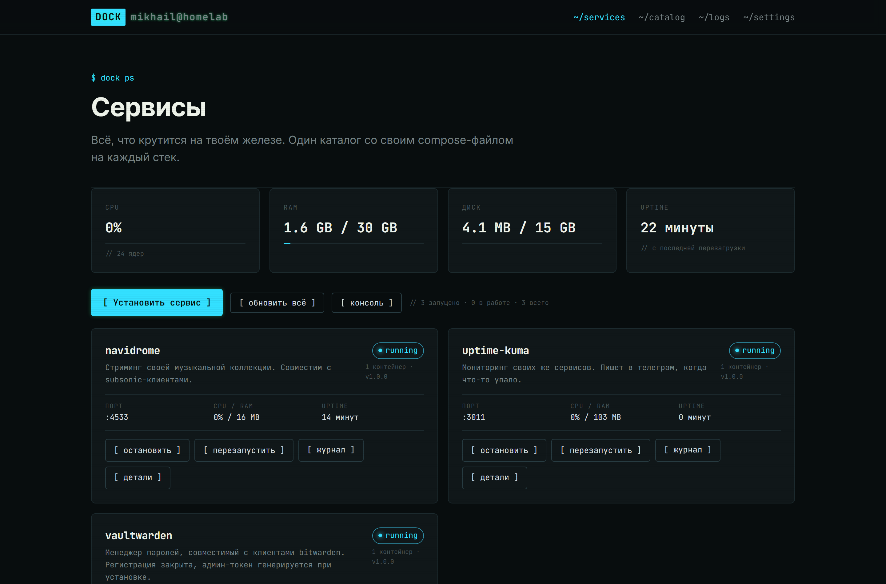
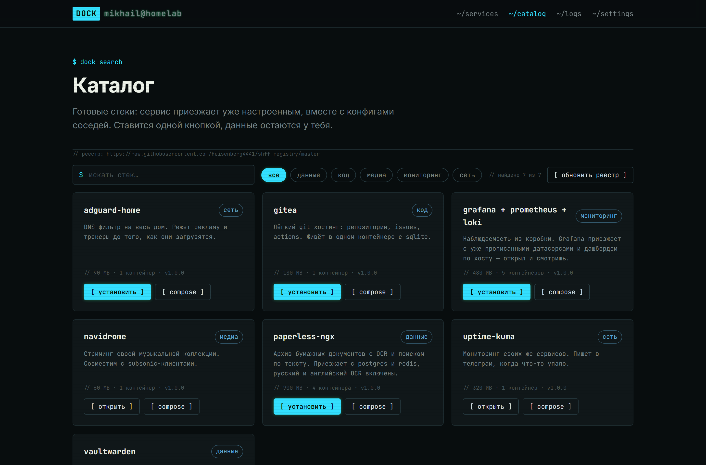
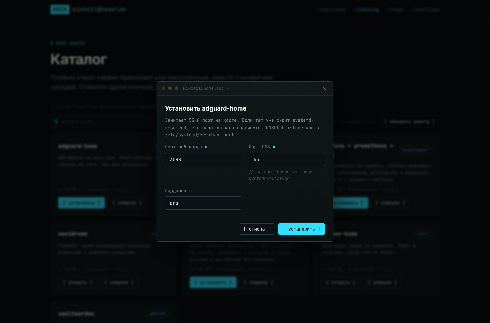
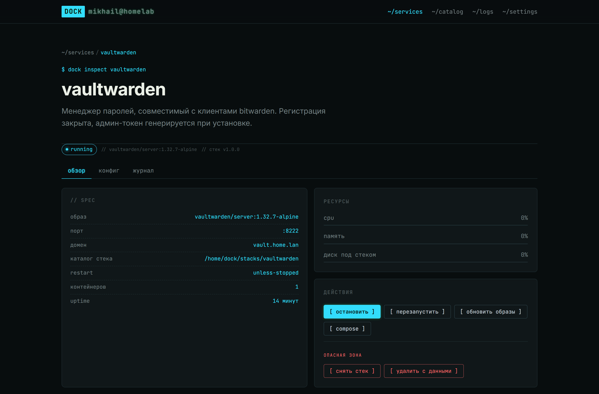
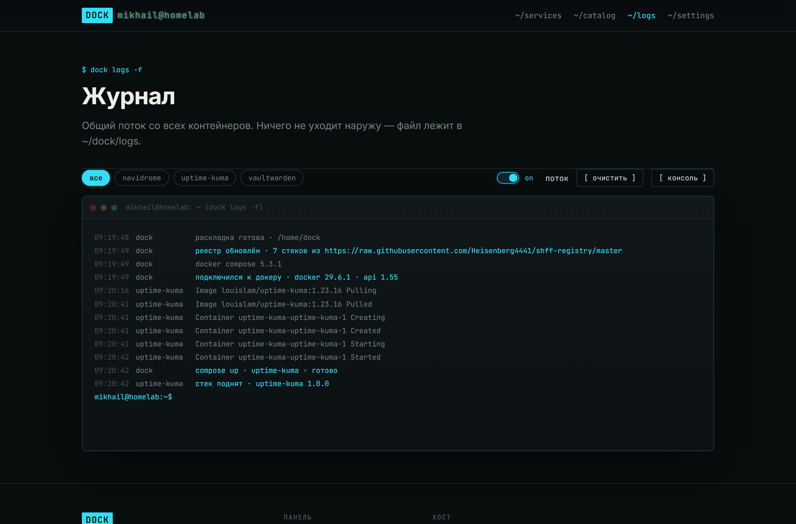

<div align="center">

# SHFF Dock

**Домашний сервер без консоли.** Ставите панель одной командой — дальше сервисы
устанавливаются кнопкой, а данные остаются на вашем железе.

[](https://github.com/Heisenberg4441/shff-dock/actions/workflows/ci.yml)
[](https://github.com/Heisenberg4441/shff-dock/actions/workflows/docker.yml)
[](https://hub.docker.com/r/heisenberg4441/shff-dock)

</div>



---

## Установка

Чистая Debian или Ubuntu, одна команда:

```bash
curl -fsSL https://raw.githubusercontent.com/Heisenberg4441/shff-dock/master/install.sh | sudo bash
```

Скрипт сам обновит систему, поставит докер, подготовит всё нужное и в конце
напечатает адрес, по которому открылась панель. Собирать ничего не надо.

Та же команда позже обновит панель — данные она не трогает.

<details>
<summary>Если нужен другой порт или без обновления системы</summary>

```bash
curl -fsSL https://raw.githubusercontent.com/Heisenberg4441/shff-dock/master/install.sh \
  | sudo bash -s -- --port 8080 --no-upgrade
```

`--no-upgrade` пропускает `apt upgrade` всей машины — по умолчанию он делается.
Полный список ключей: `--help`.

</details>

## Что это

Панель показывает, что крутится на вашем железе, и умеет ставить новое. Не
обёртка над `docker ps`: каждый сервис приезжает **уже настроенным** — с
конфигами, паролями и связанными между собой соседями.

Поставить grafana с prometheus и loki — это одна кнопка и одна форма, а не час
с чужими compose-файлами.

### Каталог

Готовые стеки: выбираете сервис, панель показывает, сколько он весит и из
скольких контейнеров состоит.



### Установка — одна форма

Форма собирается из описания сервиса. Порты проверяются на занятость, пароли и
токены генерируются сами, подсказки объясняют неочевидное.



### Карточка сервиса

Состояние, ресурсы, куда легли данные, и всё управление рядом.



### Журнал

Общий поток со всех контейнеров, живой. Наружу ничего не уходит.



## Что можно поставить

| Сервис | Зачем |
|---|---|
| **grafana + prometheus + loki** | Наблюдаемость из коробки: датасорсы и дашборд по хосту уже прописаны |
| **vaultwarden** | Менеджер паролей, работает с клиентами bitwarden |
| **gitea** | Лёгкий git-хостинг: репозитории, issues, actions |
| **gitlab-ce** | То же, но по-взрослому: CI/CD, реестр образов, доски задач |
| **paperless-ngx** | Архив бумажных документов с OCR и поиском по тексту |
| **adguard-home** | DNS-фильтр на весь дом, режет рекламу до загрузки |
| **uptime-kuma** | Следит за своими же сервисами, пишет в телеграм |
| **qbittorrent** | Торрент-клиент с веб-мордой, качает в фоне |
| **navidrome** | Стриминг своей музыки, совместим с subsonic-клиентами |
| **torrserver** | Смотрит торренты потоком, отдаёт их телевизору |

Список живёт в отдельном репозитории
[**shff-registry**](https://github.com/Heisenberg4441/shff-registry) и
обновляется сам — новые сервисы появляются в каталоге без переустановки панели.

## Ваши данные — ваши

Всё, что панель создаёт, лежит в `/home/dock` и больше нигде. Никаких скрытых
баз: каталог сервиса самодостаточен — скопировали на другую машину, сделали
`docker compose up -d`, получили тот же сервис.

Панель ничего не отправляет наружу. Единственный внешний запрос — список
доступных сервисов с гитхаба, и тот кэшируется.

## Настройка

Обычно ничего менять не нужно. Если нужно — правится в `/opt/shff-dock/.env`:

| Переменная | По умолчанию | Зачем |
|---|---|---|
| `DOCK_PANEL_PORT` | `7788` | Порт панели |
| `DOCK_ROOT` | `/home/dock` | Где лежат сервисы и их данные |
| `DOCK_REGISTRY_URL` | реестр SHFF | Свой репозиторий сервисов |
| `DOCK_PUID` / `DOCK_PGID` | `1000` | Владелец каталогов с данными |

После правки: `docker compose -p shff-dock -f /opt/shff-dock/docker-compose.yml up -d`.

## Свой каталог сервисов

Реестр — это обычный репозиторий на гитхабе. Форкаете
[shff-registry](https://github.com/Heisenberg4441/shff-registry), добавляете свои
сервисы и указываете панели:

```bash
DOCK_REGISTRY_URL=https://raw.githubusercontent.com/<вы>/<ваш-реестр>/master
```

Как описываются сервисы — [в README реестра](https://github.com/Heisenberg4441/shff-registry#как-описывается-сервис).

## Важно знать

- **У панели нет аутентификации.** Она рассчитана на локальную сеть или на
  reverse proxy с авторизацией перед ней. Наружу в интернет выставлять нельзя.
- **Панель имеет доступ к докер-сокету**, то есть фактически права root на
  машине. Это цена управления контейнерами — но и причина не открывать её всем.

## Разработка

```bash
npm install
npm run build -w @dock/shared
npm run dev     # ядро на :7788 с выдуманным хостом + панель на :5173
```

Докер для разработки не нужен: без него панель поднимается на синтетическом
хосте и честно помечает это полосой сверху.

Как всё устроено внутри — [docs/ARCHITECTURE.md](docs/ARCHITECTURE.md).

---

<div align="center">
<sub>Скриншоты сняты с работающей панели, цифры настоящие.</sub>
</div>
